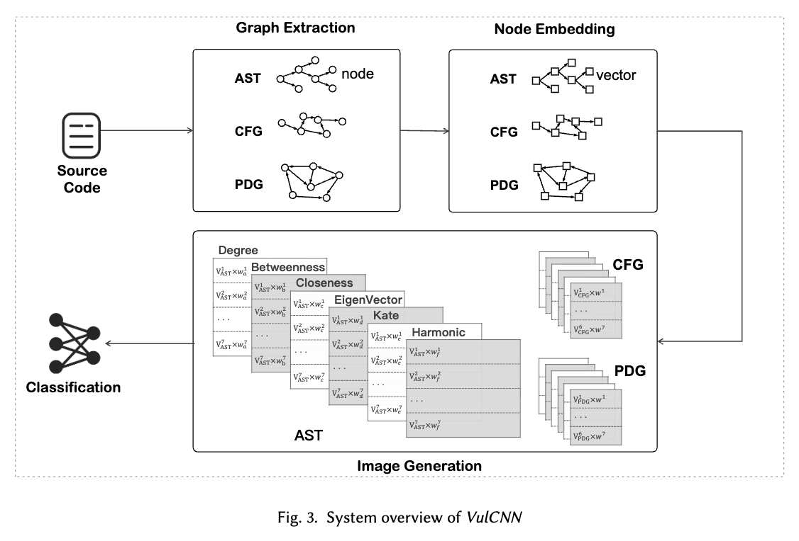

# VulCNN Plus


A Scalable Vulnerability Detection System with Multi-View Graph Representations

 
 

## Overview

VulCNN Plus consists of four main phases: Graph Extraction, Node Embedding, Image Generation, and Classification.


### Graph Extraction

Given the source code of a function, we first normalize them and then perform static analysis to extract the abstract syntax tree, the control flow graph, and the program dependency graph of the function.


### Node Embedding

Each function graph of a function (i.e., AST, CFG, and PDG) has multiple nodes.
We regard specific information of each node as a text and embed them into a vector.


### Image Generation

After embedding all nodes of the function graphs, we apply centrality analysis to obtain the importance of all nodes and multiply them by the vectors one by one.
For each function graph, we can obtain an image which embeds the program details.


### Classification
Our final phase focuses on classification.
Given generated multi-view images, we first train a parameter-shared CNN model and then use it to detect vulnerability.


## Usage

VulCNN Plus is an extension of VulCNN (VulCNN: An Image-Inspired Scalable Vulnerability Detection System) from ICSE 2022. 
It further enhances the model's vulnerability detection capability by expanding the graph from a single graph to multiple graphs and enriching social network analysis approaches.
The training steps are similar to [original repository](https://github.com/CGCL-codes/VulCNN).

### Step 1: Code normalization
Normalize the code with normalization.py (This operation will overwrite the data file, please make a backup)
```bash
python ./normalization.py -i [YOUR_DATA_ROOT] -d
```
### Step 2: Generate graphs with the help of joern
Prepare the environment refering to: [joern](https://github.com/joernio/joern) you can try the version between 1.1.995 to 1.1.1125

```bash
# first generate .bin files
python joern_graph_gen.py  -i [YOUR_DATA_ROOT]/normalized -o [YOUR_DATA_ROOT]/processed/bins -t parse

# then generate pdgs (.dot files)
python joern_graph_gen.py  -i [YOUR_DATA_ROOT]/processed/bins -o [YOUR_DATA_ROOT]/processed/graphs -t export -r pdg
python joern_graph_gen.py  -i [YOUR_DATA_ROOT]/processed/bins -o [YOUR_DATA_ROOT]/processed/graphs -t export -r cfg
python joern_graph_gen.py  -i [YOUR_DATA_ROOT]/processed/bins -o [YOUR_DATA_ROOT]/processed/graphs -t export -r ddg
python joern_graph_gen.py  -i [YOUR_DATA_ROOT]/processed/bins -o [YOUR_DATA_ROOT]/processed/graphs -t export -r ast
```

### Step 3: Generate images from the graphs
Generate Images from the pdgs with ImageGeneration.py, this step will output a .pkl file for each .dot file.

```bash
python ImageGeneration.py -i [YOUR_DATA_ROOT]/processed/graphs -o [YOUR_DATA_ROOT]/processed/output_pkl -m ./dataset/data_model.bin
```

### Step 4: Integrate the data and divide the training and testing datasets

Integrate the data and divide the training and testing datasets with generate_train_test_data.py, this step will output a train.pkl and a test.pkl file.

```bash
python generate_train_test_data.py -i [YOUR_DATA_ROOT]/processed/output_pkl -o [YOUR_DATA_ROOT]/processed/train_test_pkl -d
```

### Step 5: Train with CNN
```bash
python VulCNN.py -i [YOUR_DATA_ROOT]/processed/train_test_pkl -d
```

## Reference


```
@INPROCEEDINGS{vulcnn2022,
  author={Wu, Yueming and Zou, Deqing and Dou, Shihan and Yang, Wei and Xu, Duo and Jin, Hai},
  booktitle={2022 IEEE/ACM 44th International Conference on Software Engineering (ICSE)}, 
  title={VulCNN: An Image-inspired Scalable Vulnerability Detection System}, 
  year={2022},
  pages={2365-2376},
  doi={10.1145/3510003.3510229}}
```

## Publication

Shihan Dou, Huiyuan Zheng, Junjie Shan, Yueming Wu, Deqing Zou, Xuanjing Huang, and Yang Liu. 2025. A Scalable Vulnerability Detection System with Multi-View Graph Representations. ACM Trans. Softw. Eng. Methodol. Just Accepted (October 2025). https://doi.org/10.1145/3770075

```

@article{10.1145/3770075,
author = {Dou, Shihan and Zheng, Huiyuan and Shan, Junjie and Wu, Yueming and Zou, Deqing and Huang, Xuanjing and Liu, Yang},
title = {A Scalable Vulnerability Detection System with Multi-View Graph Representations},
year = {2025},
publisher = {Association for Computing Machinery},
address = {New York, NY, USA},
issn = {1049-331X},
url = {https://doi.org/10.1145/3770075},
doi = {10.1145/3770075},
note = {Just Accepted},
journal = {ACM Trans. Softw. Eng. Methodol.},
month = oct,
keywords = {Vulnerability Detection, CNN, Large Scale, Image}
}


```